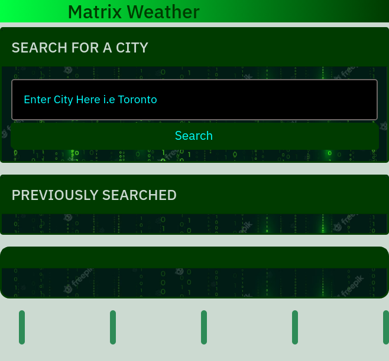

# 06-Matrix-Weather

## Description

This is a weather forecasting website that provides the user with up-to-date weather information for a given city. It allows the user to search for a city and view the current weather conditions, as well as a 5-day forecast for that location. The purpose of the website is to provide users with an easy-to-use platform to quickly access accurate weather information for their desired location.

## Table of Contents

- [Installation](#installation)
- [Usage](#usage)
- [Credits](#credits)
- [License](#license)

## Installation

- [Live link](https://shaynefw.github.io/06-matrix-weather/)
- [Repo link](https://github.com/shaynefw/06-matrix-weather)

## Usage

1. Enter a city name in the search bar and hit the search button.
The website will display the current weather conditions of the entered city.
The five-day forecast of the entered city will be displayed below the current weather conditions.
2. The search history of the previously searched cities will be displayed on the right-hand side of the page.
3. To clear the search history, click the "Clear Search History" button under the search history section. (feature coming soon! for now delete history from dev tools)
4. To view the weather conditions of a previously searched city, simply click on its name in the search history section.

## Credits

tutors, instructors, google, prof

## License

MIT License

Copyright (c) 2023 Shayne Whayne

Permission is hereby granted, free of charge, to any person obtaining a copy
of this software and associated documentation files (the "Software"), to deal
in the Software without restriction, including without limitation the rights
to use, copy, modify, merge, publish, distribute, sublicense, and/or sell
copies of the Software, and to permit persons to whom the Software is
furnished to do so, subject to the following conditions:

The above copyright notice and this permission notice shall be included in all
copies or substantial portions of the Software.

THE SOFTWARE IS PROVIDED "AS IS", WITHOUT WARRANTY OF ANY KIND, EXPRESS OR
IMPLIED, INCLUDING BUT NOT LIMITED TO THE WARRANTIES OF MERCHANTABILITY,
FITNESS FOR A PARTICULAR PURPOSE AND NONINFRINGEMENT. IN NO EVENT SHALL THE
AUTHORS OR COPYRIGHT HOLDERS BE LIABLE FOR ANY CLAIM, DAMAGES OR OTHER
LIABILITY, WHETHER IN AN ACTION OF CONTRACT, TORT OR OTHERWISE, ARISING FROM,
OUT OF OR IN CONNECTION WITH THE SOFTWARE OR THE USE OR OTHER DEALINGS IN THE
SOFTWARE.

---

## Badges

- 
- 
- 

## Features

- Search bar: Allows users to search for the weather in a specific city.

- Weather display: Displays current weather conditions, including temperature, wind speed, humidity, and a weather icon.

- Five-day forecast: Provides a five-day forecast for the selected city, including date, temperature, wind speed, humidity, and a weather icon for each day.

- Search history: Keeps a record of previous searches and allows users to easily access them.

## How to Contribute

N/A

## Tests

N/A